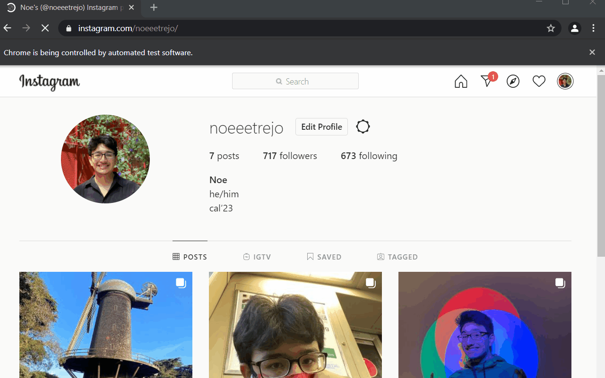
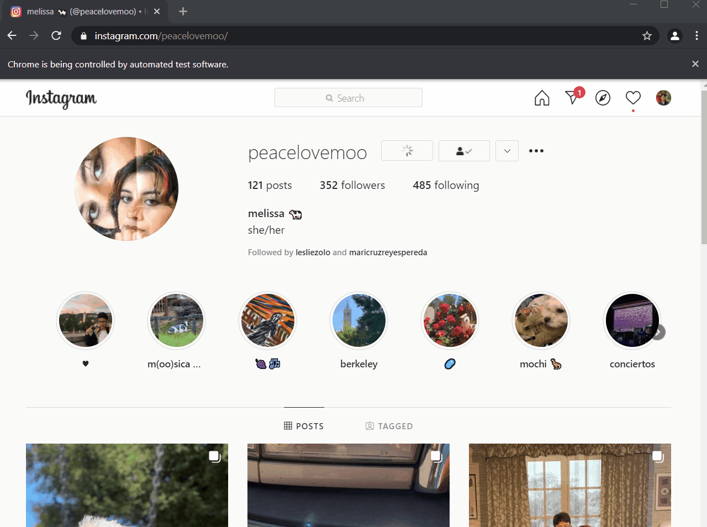

# InstaUnfollower

My Instagram got hacked into, and they followed a lot of accounts. 
Instead of painstakingly going through every person and unfollowing them, I decided to learn something from it. 
I made an Instagram bot using Selenium! 

## Working Bot:

## Selenium: 

"Selenium Webdriver is an open-source collection of APIs which is used for testing web applications. The Selenium Webdriver tool is used for automating web application testing to verify that it works as expected or not. It mainly supports browsers like Firefox, Chrome, Safari and Internet Explorer. It also permits you to execute cross-browser testing."
[Selenium](https://selenium-python.readthedocs.io/)

While I didn't use Selenium to automate tests, I managed to make something else about it and learned a new awesome Library! 
I made a class for the bot and gave it a few functions, but just what I needed.

## Shrek Script:

You can send the Shrek Script!!!

